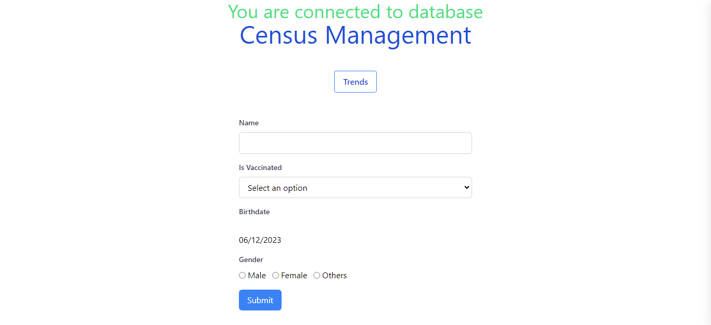
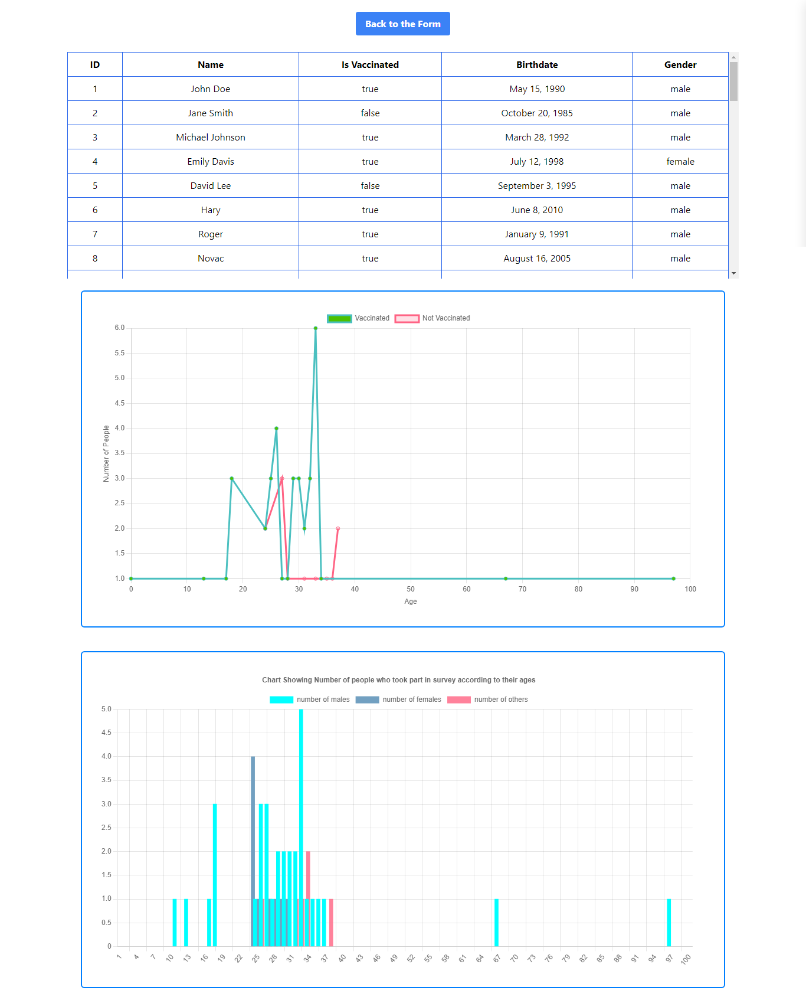

# Census Management


## A basic Vaccination census system and trend analysis

go to the complete description of the project <a name="project-description"></a>

### Stack
PostgreSQL<br>
Express<br>
React<br>
Node<br>
<br>




### How to install

clone the repo 
```
git clone https://github.com/Akul-sada/Census-System.git
```

```
cd Census-System
```
#### Install Nodejs dependencie
```
cd server
```
```
npm install
```
download nodemon globally
```
npm start
```
### Install Reactjs dependencies

```
cd .. 
```
```
cd front-end
```
```
npm install
```
```
npm start
```
### I have included census_management.sql file. Create a new database with the name "Census_Management" right click on the database click restore option select the file(census_management.sql) included. The table with database will be created.

### Steps Implimented for the project <br>
-Connected to a PostgresSQL database and created the table in Express Nodejs<br>
-Wrote Queries needed to draw the graphs given in the project description<br>
-Used Tailwind CSS for UI in ReactJs<br>
-Used Axios for GET and POST request<br>
-Used react-chartjs to design chart<br>

## Project description 
(#project-description)

A basic vaccination census system and trend analysis

Screen 1: Census Management
    1. Have a screen where you accept a name field, a gender field, a birth date field
    2. Record the following information from the submission:
        a. Name: Larry Page
        b. Gender: Male / Female / Other
        c. Birth Date: Date picker (limit to last 100 years, disable selecting future date)
        d. Vaccinated: Yes / No
    3. Save this information into an RDBMS database (Preferably, PostgreSQL)

Screen 2: Trend in census
    1. Show a table for each entry in the census, with all 4 information points
    2. Draw a Line Chart (Number of vaccinated / unvaccinated people vs age)
        a. There should be two lines for the two choices. One for yes/true, other for no/false choice
        b. Keep age as X-axis and Number of vaccinated / unvaccinated as Y axis
        c. Preferably pick different colors for the two choices (generally libraries take care of this) so they can be differentiated
    3. Draw a Bar Graph for number of people from each gender polled for the census vs age
        a. X-axis would be different ages (0-100)
        b. Y axis would be the number of people for each choice
        c. There would be 3 bars for each point in X axis - one bar for each gender

    • You may use any chart library you are comfortable with. (If you want a recommendation, Chartjs)
    • You may use any SPA frontend library you are comfortable with (react, vue, angular etc). (Recommendation: material-ui if you are comfortable with react)
    • You may use any backend framework / language you are comfortable with (Bonus points for node.js / express)

Hint Plan: (Just a suggestion, you can solve however you feel comfortable)
You can make both the tasks just in single page by making Screen 1 a popup / dialog / modal

For form, you need POST API http://localhost:3000/vote Request Body structure:
{
name: ‘Larry’, is_vaccinated: true, birthdate: ‘20-11-1997’, gender: ‘male’
}
You can use the simplest way to store the data: Create table “people” with columns (PSQL or MySQL) id (serial) not null (PRIMARY KEY)
name (text) not null, is_vaccinated (boolean), birthdate (timestamp) not null,
gender (enum - “male”, “female”, “other”) not null,

You need GET API to display in the table: Route: http://localhost:3000/data Response Structure:
{
data: [
{id: ‘1’, name: ‘abc’, is_vaccinated: true, birthdate: ‘12-11-1997’, gender: “male”},
{id: ‘2’, name: ‘xyz’, is_vaccinated: true, casted_at: ‘12-11-1996’, gender: “female”},
{id: ‘3’, name: ‘someone’, is_vaccinated: false, casted_at: ‘13-11-1994’, gender: “female”},
{id: ‘4’, name: ‘pqr’, is_vaccinated: true, casted_at: ‘14-11-1995’, gender: “male”},
]
}


For Line Chart GET API (You can keep the structure depending on the chart library you pick, but this is generic)
Route: http://localhost:3000/counts?is_vaccinated=true (similarly, for the other voting choice, the path would be http://localhost:3000/counts?is_vaccinated=false )
Response Structure:
{
data: [
{count: 2, age: 15},
{count: 1, age: 16},
… (there would be an entry for each age for which there are people counted in the census)
]
}


For Bar Graph GET API (You can keep the structure depending on the chart library you pick, but this is generic)
Route: http://localhost:3000/results Response Structure:
{
data: [
{count: 3, gender: ‘male’, age: 15},
{count: 1, gender: ‘female’, age: 15},
{count: 4, gender: ‘male’, age: 16},
{count: 3, gender: ‘female’, age: 16},
{count: 3, gender: ‘other’, age: 16},
]
}


Bonus points:
    • Create nice documentation in the README.md file. Explain steps to set up and run the project.
    • Also, mention the libraries you used and links to those.


